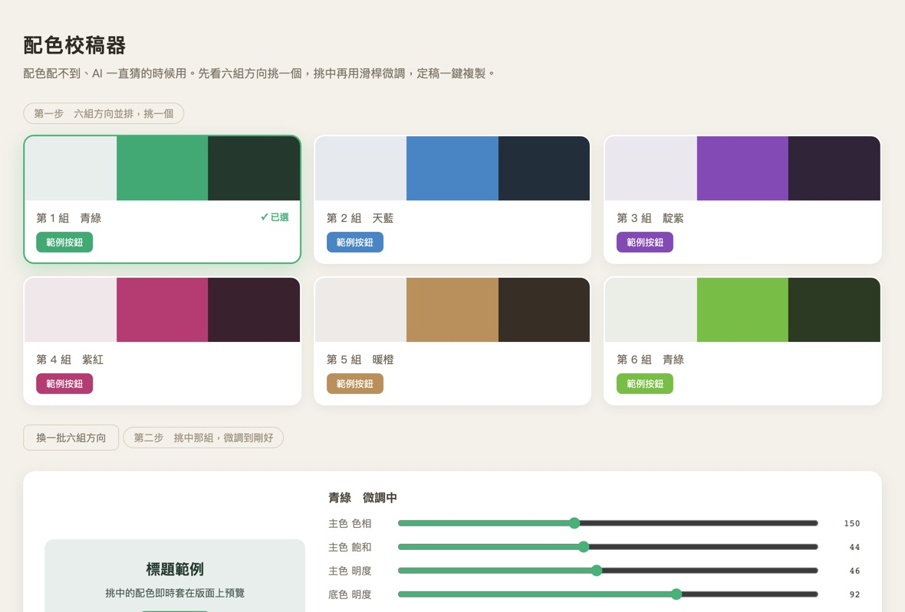
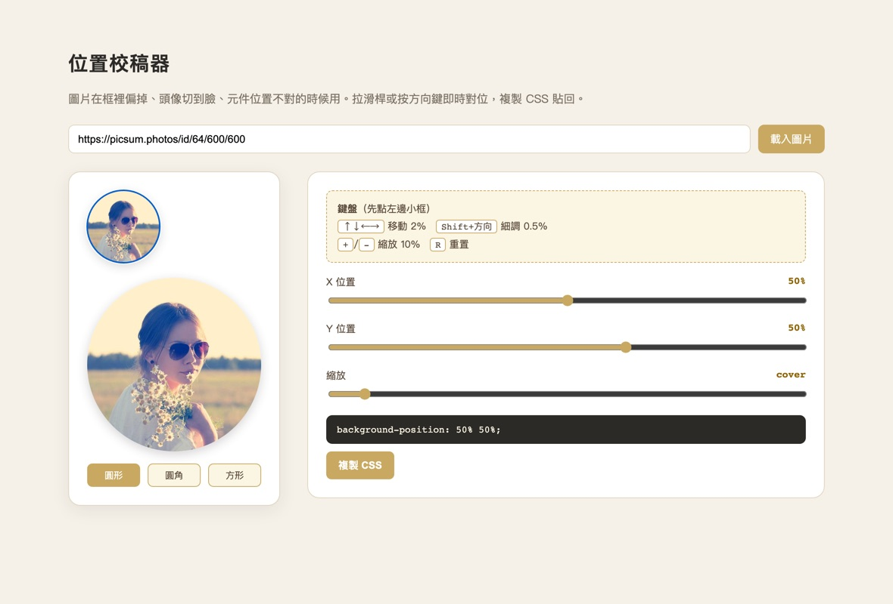
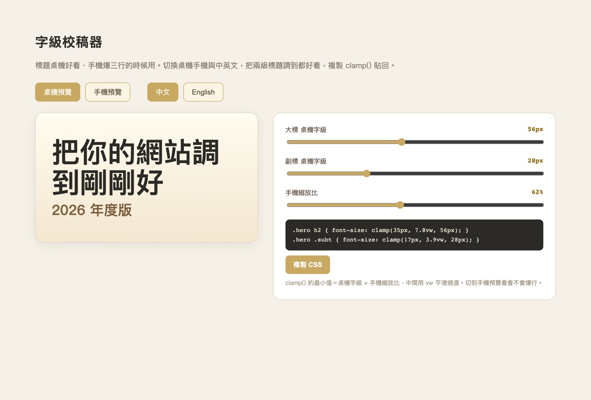
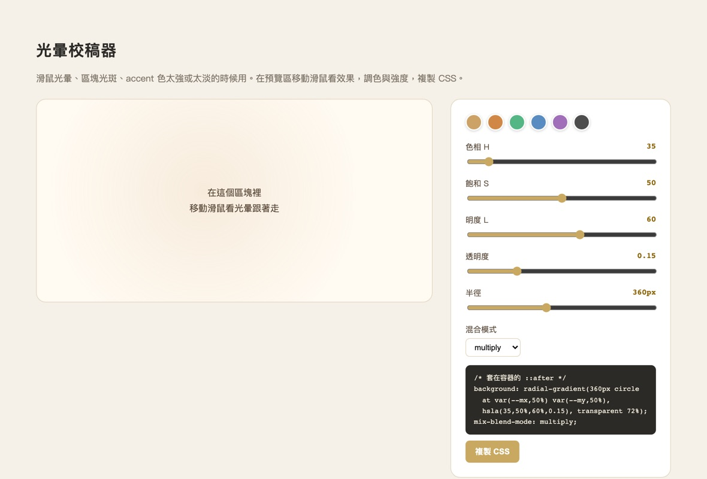

# AI 網頁微調術 · ai-web-tuner

> 用 AI 做網頁，大部分都還好，卡關的總是那些「肉眼才看得出對不對」的小地方。這套方法和四個現成的校稿器，幫你把「讓 AI 一直猜」變成「自己拉到滿意，複製 CSS」。

## 你是不是也遇過

跟 AI 一起做網頁，內容、排版它都做得不錯。真正讓人抓狂的，是這些小地方：

- 圖片在框裡的位置偏了、頭像剛好切到臉
- 某個元件太大或太小、間距就是差一點
- 配色一直配不到你心裡那個調，它換一個你說不對，再換又太花
- 滑鼠光暈、陰影太重或太淡
- 首頁大標桌機好看，手機就爆成三行

這些都得「看到」才知道對不對。交給 AI 反覆「改一個值、你截圖、它再看、再改」，又慢又燒額度，雙方都耗。

## 換個做法

遇到這種肉眼微調，不要讓 AI 猜值。請它（或直接用這裡的範本）做一個瀏覽器內的**校稿器**，你自己拉滑桿、按方向鍵，即時看效果，調到滿意，按一個鈕把 CSS 複製貼回正式版。

省下大量來回，token 也省 10 到 20 倍。

## 四個校稿器，打開就能用

| 校稿器 | 解什麼 |
|--------|--------|
| [配色校稿器](tuners/palette-tuner.html) | 配色配不到、一直猜：六組方向並排挑，挑中再微調，複製 CSS 變數 |
| [位置校稿器](tuners/position-tuner.html) | 圖片位置、元件大小裁切：雙預覽＋滑桿＋方向鍵細調＋複製 |
| [字級校稿器](tuners/type-scale-tuner.html) | 標題字太大太小、雙語站爆行：桌機⇄手機預覽＋兩級字級＋複製 clamp() |
| [光暈校稿器](tuners/color-glow-tuner.html) | 光暈、陰影、accent 色：HSL 三軸＋預設色卡＋透明度半徑＋複製 |

入口頁：[tuners/index.html](tuners/index.html)

## 長什麼樣

**配色校稿器**：六組方向並排挑，挑中再用 HSL 微調，複製 CSS 變數。

**位置校稿器**：貼任意圖片網址，雙預覽加滑桿加方向鍵細調。

**字級校稿器**：桌機手機與中英預覽，兩級標題，複製 clamp()。

**光暈校稿器**：在預覽區移動滑鼠看光暈，HSL 加色卡加透明度半徑。

## 怎麼用

1. 把這個 repo 下載或 clone 下來。
2. 用瀏覽器打開 `tuners/index.html`，挑一支對應你問題的校稿器。
3. 把校稿器裡的元件換成你的（改一下尺寸、貼上你的圖片網址），或直接在上面試。
4. 拉到滿意，按「複製 CSS」，貼回你的網頁。

也可以把整個 repo 當成技能包丟給你的 AI 助手（裡面有 `SKILL.md`），讓它在你做網頁卡在微調時，自動照這套方法幫你產校稿器。

## 核心原則

- 肉眼才判斷得出的微調，建工具讓自己拉，不要 AI 反覆猜值。
- 來回試兩三次還沒定案，就該給校稿器了。
- 配色、版型這種方向未定的，先給六組並排挑方向，再微調。
- 校稿器拉到極端值還是不對，回頭檢查素材（例如圖根本沒拍到那個部位）。

## 授權

MIT License。歡迎自由使用、改寫、教學、商用。

作者：江昱德（江江教練）。整理自實際用 AI 做網頁的工作流，分享給也在用 AI 做網站的人。
